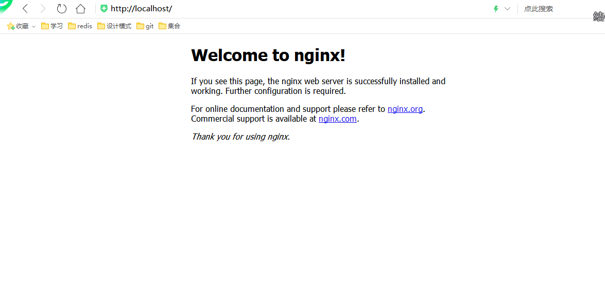

# Nginx入门

### Nginx安装

#### 1.windows安装

​	从官方网站上下载对应版本的nginx，解压完成后的目录结构如

.jpg)

​	启动nginx命令

```
 G:\nginx-1.13.9>start nginx.exex 
```

##### 访问nginx

​	打开浏览器，输入地址:(http://localhost/)，访问页面如下图

  

##### 停止nginx

```
G:\nginx-1.13.9>nginx -s stop
```

##### 修改配置文件后重新加载

```
G:\nginx-1.13.9>nginx -s reload
```

​	注意：修改配置文件之后，直接start nginx，这样就会多启一个nginx进程。在实际应用场合中可能导致请求获取不到。

### Nginx配置

- main:用于进行nginx全局信息的配置
- events：用于进行nginx工作模式的配置
- http：用于进行http协议信息的一些配置
- server:用于进行服务器访问信息的配置
- location：用于进行访问路由的配置

#### main模块

```nginx
#user  nobody;
worker_processes  1;

#error_log  logs/error.log;
#error_log  logs/error.log  notice;
#error_log  logs/error.log  info;

#pid        logs/nginx.pid;

```

- user用来指定ningx worker进程运行用户以及用户组，默认nobody账户运行
- worker_processes指定nginx要开启的子进程数量，运行过程中监控每个进程消耗内存(一般几M~几十M不等)根据实际情况进行调整，通常数量是CPU内核数量的整数倍
- error_log定义错误日志文件的位置及输出级别[debug / info / notice / warn / error / crit]
- pid用来指定进程id的存储文件的位置

### event 模块

```nginx
events {
    worker_connections  1024;
}
```

- worker_connections 指定最大可以同时接收的连接数量，这里一定要注意，最大连接数量是和worker processes共同决定的。

### http模块

```nginx
http {
    include       mime.types;
    default_type  application/octet-stream;

    #log_format  main  '$remote_addr - $remote_user [$time_local] "$request" '
    #                  '$status $body_bytes_sent "$http_referer" '
    #                  '"$http_user_agent" "$http_x_forwarded_for"';

    #access_log  logs/access.log  main;

    sendfile        on;
    #tcp_nopush     on;

    #keepalive_timeout  0;
    keepalive_timeout  65;

    #gzip  on;
```

- sendfile on：配置on让sendfile发挥作用，将文件的回写过程交给数据缓冲去去完成，而不是放在应用中完成，这样的话在性能提升有有好处
- keepalive_timeout 10：给客户端分配连接超时时间，服务器会在这个时间过后关闭连接。一般设置时间较短，可以让nginx工作持续性更好
- tc_nopush on：让nginx在一个数据包中发送所有的头文件，而不是一个一个单独发

### server模块

```nginx
server {
        listen       80;
        server_name  localhost;

        #charset koi8-r;

        #access_log  logs/host.access.log  main;

        location / {
            root   html;
            index  index.html index.htm;
        }

        #error_page  404              /404.html;

        # redirect server error pages to the static page /50x.html
        #
        error_page   500 502 503 504  /50x.html;
        location = /50x.html {
            root   html;
        }

        # proxy the PHP scripts to Apache listening on 127.0.0.1:80
        #
        #location ~ \.php$ {
        #    proxy_pass   http://127.0.0.1;
        #}

        # pass the PHP scripts to FastCGI server listening on 127.0.0.1:9000
        #
        #location ~ \.php$ {
        #    root           html;
        #    fastcgi_pass   127.0.0.1:9000;
        #    fastcgi_index  index.php;
        #    fastcgi_param  SCRIPT_FILENAME  /scripts$fastcgi_script_name;
        #    include        fastcgi_params;
        #}

        # deny access to .htaccess files, if Apache's document root
        # concurs with nginx's one
        #
        #location ~ /\.ht {
        #    deny  all;
        #}
    }
```

- server：一个虚拟主机的配置，一个http中可以配置多个server
- server_name：指定ip地址或者域名，多个配置之间用空格分隔
- root：表示整个server虚拟主机内的根目录，所有当前主机中web项目的根目录
- index：用户访问web网站时的全局首页
- charset：用于设置www/路径中配置的网页的默认编码格式
- access_log：用于指定该虚拟主机服务器中的访问记录日志存放路径

### location模块

```
location / {
            root   html;
            index  index.html index.htm;
        }
```

- location /：表示匹配访问根目录
- root：用于指定访问根目录时，访问虚拟主机的web目录
- index：在不指定访问具体资源时，默认展示的资源文件列表

#### 反向代理

​	客户端本来可以直接通过HTTP协议访问某网站应用服务器，网站管理员可以在中间加上一个Nginx，客户端请求Nginx，Nginx请求应用服务器，然后将结果返回给客户端，此时Nginx就是反向代理服务器。


